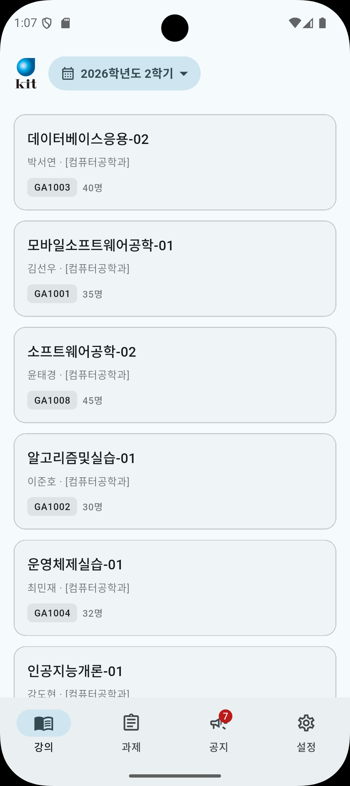
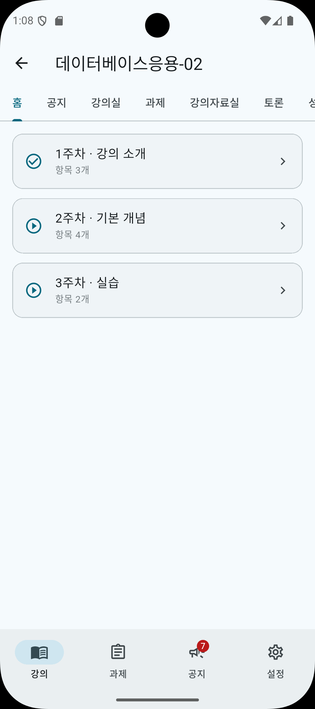
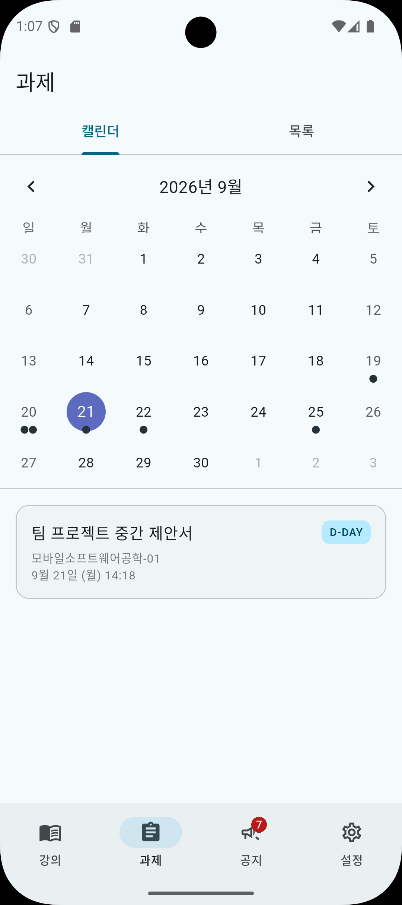
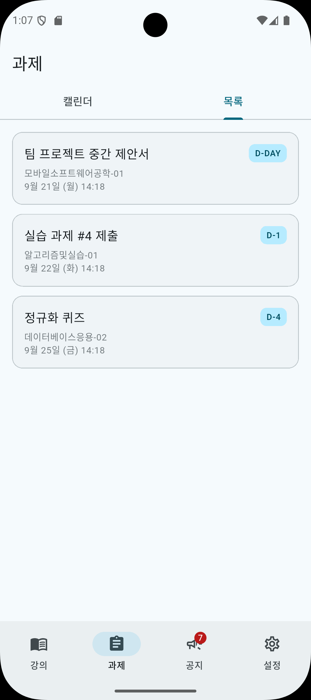
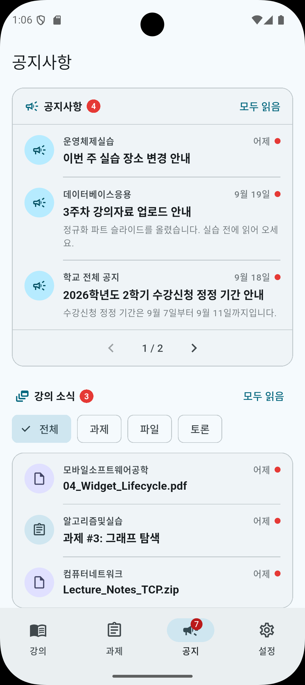
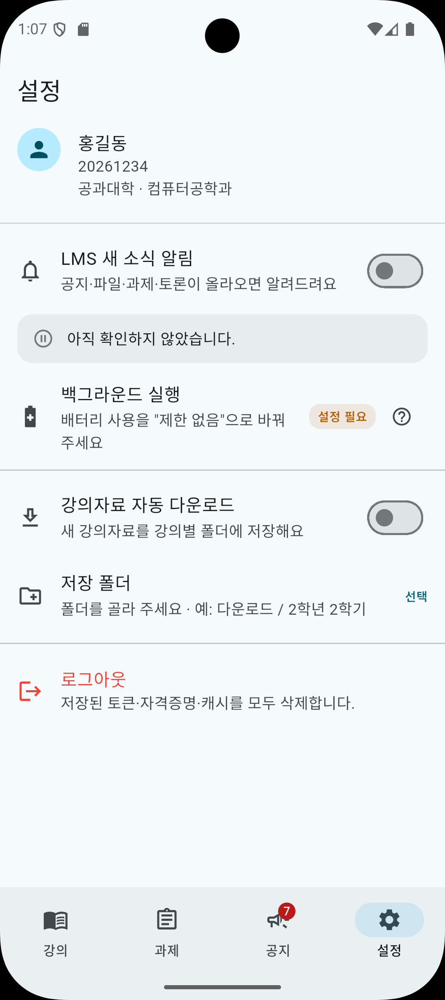

# 금오 LMS (kumoh_lms)

금오공과대학교 LINUS/Canvas LMS를 휴대폰에서 보는 Android 앱입니다. 별도 서버 없이 앱이 학교 서버에 바로 접속합니다.

APK는 이 저장소의 [Releases](https://github.com/barahana25/kumoh-LMS/releases/latest)에서만 받을 수 있습니다.

## 화면

| 강의 | 강좌 상세 | 과제 |
| --- | --- | --- |
|  |  |  |

| 과제 목록 | 공지 | 설정 |
| --- | --- | --- |
|  |  |  |

## 설치

Android 7.0(API 24) 이상에서 동작합니다.

1. [Releases](https://github.com/barahana25/kumoh-LMS/releases/latest)에서 최신 `app-release.apk`를 받습니다.
2. 설치하려면 APK를 연 앱(브라우저·파일 관리자)에 "이 출처의 앱 설치 허용"을 켜야 합니다.
3. Play Protect가 "알 수 없는 개발자" 경고를 띄울 수 있습니다.

## 다루는 정보

- 학번·비밀번호와 조회한 내용은 개발자 서버를 거치지 않습니다. 기기와 학교 서버가 직접 주고받습니다.
- 자동 로그인을 켜야 자격증명이 기기 보안 저장소에 암호화돼 저장됩니다. 조회 결과는 암호화된 로컬 DB(SQLCipher)에 캐시로 남습니다.
- 로그아웃하거나 앱을 지우면 저장된 자격증명과 캐시가 함께 지워집니다.
- 광고·분석 SDK를 넣지 않았습니다. 자세한 내용은 [privacy.html](privacy.html)에 있습니다.

## 주요 기능

- **강의**: 현재 학기 수강 강좌 목록. 강좌마다 `홈 - 공지 - 강의실 - 과제 - 강의자료실 - 토론 - 성적 - 사용자 및 그룹 - 강의 계획` 탭을 같은 순서로 보여 줍니다.
- **과제**: 마감일 캘린더와 목록. 기한이 없는 과제는 따로 모으고 제출한 과제는 '제출 완료'로 표시합니다.
- **공지사항**: 전체 공지와 강의 소식(과제·강의자료·토론)을 시간순으로 합쳐 보여 주고 안 읽은 소식에 표시를 남깁니다.
- **인앱 웹뷰**: Canvas 링크를 SSO 로그인된 상태로 앱 안에서 엽니다. PDF 같은 파일은 받아서 기기 뷰어로 넘깁니다.
- **새 소식 알림**: 새 공지·파일·과제·토론 글을 정해진 시각마다 확인해 기기 알림으로 띄웁니다. 자세한 내용은 [docs/notifications.md](docs/notifications.md)에 있습니다.
- **강의자료 자동 다운로드**: 선택한 폴더에 강의별로 자료를 저장합니다. 자세한 내용은 [docs/downloads.md](docs/downloads.md)에 있습니다.
- **오프라인 캐시**: 암호화된 로컬 DB에 마지막 조회 결과를 보관해 네트워크가 없을 때도 볼 수 있습니다.

## 구조

```
UI (Riverpod) → Repository → dio + Drift(SQLCipher) 캐시
```

| 경로 | 내용 |
| --- | --- |
| `lib/core/` | 설정(`config/env.dart`), 오류 모델, 네트워크(토큰 부착·자동 재발급), 라우터, 저장소, 공통 UI |
| `lib/features/auth/` | 로그인, 세션 복원, 자동 로그인 |
| `lib/features/courses/`, `assignments/`, `announcements/`, `reference/` | LINUS API 기반 강좌·과제·공지·학기 |
| `lib/features/canvas/` | Canvas SAML 브릿지, Canvas REST API, 강좌 상세 탭, 인앱 웹뷰 |
| `lib/features/notifications/`, `downloads/` | 백그라운드 알림과 자료 다운로드 |
| `lib/providers.dart` | 의존성 연결 |
| `packages/lms_folder_storage/` | Android SAF 폴더 선택·저장용 로컬 플러그인 |
| `python/` | 서버 연동 확인용 진단 스크립트 |
| `web/`, `relay/` | 실험 중인 웹 빌드와 중계 서버. 배포하는 APK와는 별개입니다 |

### 인증 흐름

1. LINUS `/login`으로 accessToken(JWT, 유효 1시간)과 refreshToken을 받습니다. 토큰은 Secure Storage에 둡니다.
2. LINUS API가 204/401을 돌려주면 `AuthInterceptor`가 `/reissue`로 재발급하고 원요청을 다시 보냅니다.
3. Canvas는 LINUS 토큰을 모르므로 SAML 브릿지를 건넙니다.
   1. LINUS `/saml/redirect.do`로 SSO 진입 URL을 받습니다. 토큰이 만료됐다면 이때 재발급됩니다.
   2. **그 다음에** 저장된 accessToken을 읽어 `.kumoh.ac.kr`에 `_linus_saml_login` 쿠키로 심습니다.
   3. IdP가 돌려준 SAML 폼을 제출해 Canvas 세션 쿠키(`_normandy_session`)를 얻습니다.

   순서가 바뀌면 만료된 토큰이 쿠키에 들어가 IdP가 `S010`(SSO 연동 요청 검증 실패)을 냅니다. 쿠키가 없으면 `A001`입니다.

## 개발 환경

- Flutter SDK (Dart `^3.5.0`)
- Android SDK
- Windows에서 `flutter test`를 돌리려면 프로젝트 루트에 `sqlite3.dll`이 있어야 합니다(커밋하지 않습니다).

```sh
flutter pub get
dart run build_runner build --delete-conflicting-outputs   # Drift 코드 생성
flutter analyze
flutter test
flutter run
```

직접 빌드하면 서명 키가 없어 디버그 키로 서명됩니다. 기기는 이걸 배포본과 다른 앱으로 봅니다.

```sh
flutter build apk --release
```

## 릴리스

배포는 GitHub Actions으로 합니다([.github/workflows/release.yml](.github/workflows/release.yml)).

## 문의

버그와 기능 제안은 이 저장소 Issues에 남겨 주세요. 개인정보와 배포 문의처는 [privacy.html](privacy.html)에 있습니다.
